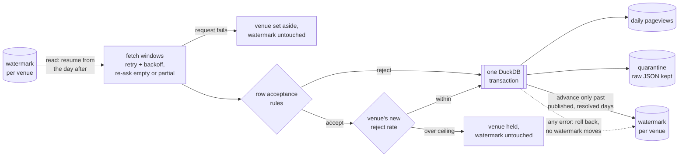

# NZ Attraction Pageviews

[](https://github.com/Kenchch/nz-attraction-pageviews/actions/workflows/ci.yml)

How much online attention eight New Zealand attractions get each day,
collected nightly from Wikipedia's pageview API into DuckDB. A day that fails,
arrives late or arrives incomplete is retried or held back, never silently
lost. For readers studying reliable API ingestion and recovery from missing data.



## What I built

- Windowed requests with retry/backoff and verification of ambiguous empty or partial responses.
- Row-level acceptance rules with raw JSON preserved in quarantine.
- Watermarks bounded by publication evidence and unresolved days.
- Per-venue failure isolation; failed venues retain their watermarks.
- Transactional loading and a run log, exercised by deterministic offline tests.

## Decisions and evidence

| Decision | Behaviour |
|---|---|
| Empty or partial responses | Widen and subdivide an empty answer, and re-ask the holes in a 200, before accepting absence |
| HTTP errors | Retry transient failures; isolate failed venues; fail only if every venue fails |
| Schema drift | Abort the entire run when the response contract changes; a body that is not JSON at all fails only its venue |
| Watermarks | Hold at unresolved rejected or unpublished days |
| Quality gate | Hold the venue, not the run |
| Status | `ok` only when every venue is complete; anything failed, held, given up, never produced or still unresolved is `degraded` |
| Releasing a hold | A day that later loads cleanly releases itself; `resolve … --accept` records that a day is never arriving |
| Idempotence | Re-requested days are overwritten; days behind settled watermarks are not re-fetched |

The offline demo replays two nights: a 90-day backfill of 720 rows, then a run
three days later that asks only for the three days it has not seen, 24 rows
across the eight venues. It ends with
744 stored rows and zero duplicate `(venue_id, view_date)` pairs, so resuming
from the watermark neither skipped nor repeated a day.

## Run it

```bash
uv sync                  # or: pip install -e . --group dev   (pip 25.1+)
python demo.py
python -m nz_attraction_pageviews --contact you@example.org --venues venues.csv --db warehouse.duckdb --backfill-days 90
pytest -q
```

A live run needs a contact for the Wikimedia User-Agent — an email address or
URL where Wikimedia can reach whoever runs the job — from `--contact` or the
`NZAP_CONTACT` environment variable. It refuses to start without one.

Use `--chunk-days`, `--max-reject-rate`, `--max-lookback-days`,
`--max-http-requests` and `--today YYYY-MM-DD` to configure the request windows,
quality threshold, lookback cap, per-run request budget and run date, and `-v`
to log each venue and window. The CLI prints operational notes as well as row
counts. Installing the package also installs the same command as
`nz-attraction-pageviews`.

Exit codes: `0` ok or degraded (read the status line), `1` nothing matched
(`resolve`) or a bad title (`check-venues`), `2` bad arguments, `3`
configuration (venues.csv, parameters, contact, missing warehouse), `4` every
venue failed, `5` schema drift, `6` the warehouse could not be opened or written.

## Running it nightly

The command is idempotent, so a scheduler only has to run it once a day and act
on the exit code:

| Exit | Meaning | What to do |
|---|---|---|
| `0` | Ran. Status `ok` or `degraded` | Nothing tonight; see the query below for standing problems |
| `4` | Every venue failed (network, HTTP, request budget) | Let the next night retry; alert if it repeats |
| `6` | Warehouse locked or unwritable | Retry later; nothing was loaded, so a retry is safe |
| `3`, `5` | Configuration or schema drift | A person has to look; retrying will not help |

cron, at 03:30 UTC (after Wikimedia's daily publication):

```bash
30 3 * * * cd /srv/nz-attraction-pageviews && NZAP_CONTACT=ops@example.org .venv/bin/nz-attraction-pageviews --db warehouse.duckdb >> ingest.log 2>&1
```

Windows Task Scheduler:

```bash
schtasks /Create /SC DAILY /ST 15:30 /TN nz-attraction-pageviews /TR "cmd /c cd /d D:\nz-attraction-pageviews && .venv\Scripts\nz-attraction-pageviews --contact ops@example.org --db warehouse.duckdb >> ingest.log 2>&1"
```

`degraded` exits 0 on purpose: the run did its job, and an alert that fires on
every standing fault gets muted. Alert instead when it persists — this counts
how many of the last three runs were not `ok`, and 3 means three nights running:

```sql
SELECT count(*) FROM (SELECT status FROM run_log ORDER BY started_at DESC LIMIT 3)
WHERE status <> 'ok';
```

## Limits

- Pageviews measure online attention, not visitor attendance.
- Use canonical article titles: redirect traffic can be plausible but incomplete.
  `python -m nz_attraction_pageviews check-venues --contact …` checks them.
- Publication lag and genuinely quiet days remain ambiguous; the trust horizon is an assumption.
- A settled watermark prevents historical restatements from being fetched automatically.
- Requests are sequential; this is an eight-venue pipeline with no orchestrator.
- Notes never release anything; no automatic historical backfill sweep is implemented.

## What this would need in production

Not built here; listed so the gaps are explicit.

- **Someone who gets paged.** Failures leave an exit code, a `degraded` status
  and quarantined rows, and the query above counts bad nights, but nothing
  sends them anywhere. Exit codes 3, 5 and 6, a repeated 4, or three non-`ok`
  runs in a row should reach an on-call channel, and quarantine needs an owner who reviews it.
- **A copy of the warehouse elsewhere.** Rows, quarantine and watermarks are
  written in one transaction, so a crash cannot leave the watermark ahead of
  the data. But they share one DuckDB file: lose it and the only recovery is
  re-fetching from Wikimedia, bounded by the lookback cap (180 days by default)
  and the request budget. It needs a nightly copy off the machine.
- **A restatement sweep.** Once a watermark passes a day, that day is never
  asked for again, so a later Wikimedia correction is missed. A periodic
  re-fetch of the last few weeks of settled days would pick those up.

## Data

Wikimedia Analytics daily `per-article`, `all-access`, `user` pageviews (CC0).
No API key is required.

[Design notes, table schemas and detailed recovery evidence](docs/DESIGN.md) ·
[Changelog and upgrade notes](CHANGELOG.md) ·
[HTTP isolation regression tests](tests/test_venue_failures.py)

## Reviewing quarantine

Repeated rejects are deduplicated by venue, date and rule; `rows_quarantined`
in the run log counts rejected observations in that run, not new unique issues.

Annotate a rejection. A note releases nothing; it is kept with the row even if
the rejection recurs:

```bash
python -m nz_attraction_pageviews resolve milford-sound 2026-02-01 --db warehouse.duckdb --note "Emailed Wikimedia, ticket T12345"
```

Accept that days are never arriving, so the watermark may step over them. This
loads no data, and only open rejections are accepted:

```bash
python -m nz_attraction_pageviews resolve milford-sound 2026-02-01..2026-02-07 --accept --note "Upstream confirmed lost" --db warehouse.duckdb
```

The day can be one date, a `FIRST..LAST` range, `null` for rows whose timestamp
had no parseable date, or `all`. A rejection whose day later loads cleanly is
marked `superseded` on its own and needs nothing. A superseded rejection that
recurs is reopened; an accepted one stays accepted. Existing historical
duplicate records are preserved.

## Live evidence

A [live seven-day run](fixtures/live/run-log.json) on 2026-09-06 loaded 56 rows
across all eight venues with zero rejects. Two captured API responses accompany
that log, and the offline suite checks them against the parser and the
acceptance rules. After installing the package, run
`python scripts/capture_live.py --contact you@example.org` to capture fresh
evidence into `captures/<date>/`. The network smoke test is opt-in and also
needs a contact: `RUN_LIVE=1 NZAP_CONTACT=you@example.org pytest -m live`
(PowerShell: set `$env:RUN_LIVE='1'` and `$env:NZAP_CONTACT` first). CI runs it
weekly.

## How this was built

I used Claude Code and OpenAI Codex as drafting tools. The problem, the data
contracts and the quality rules are mine, and so is the review: every generated
change was read and run before it was committed. The tools drafted code,
refactored and scaffolded tests.

Commits made before 6 September 2026 carried `Co-Authored-By` trailers naming
these tools. They were removed when I rewrote that history; most commits since
then carry them, and each pull request states its own AI involvement.
